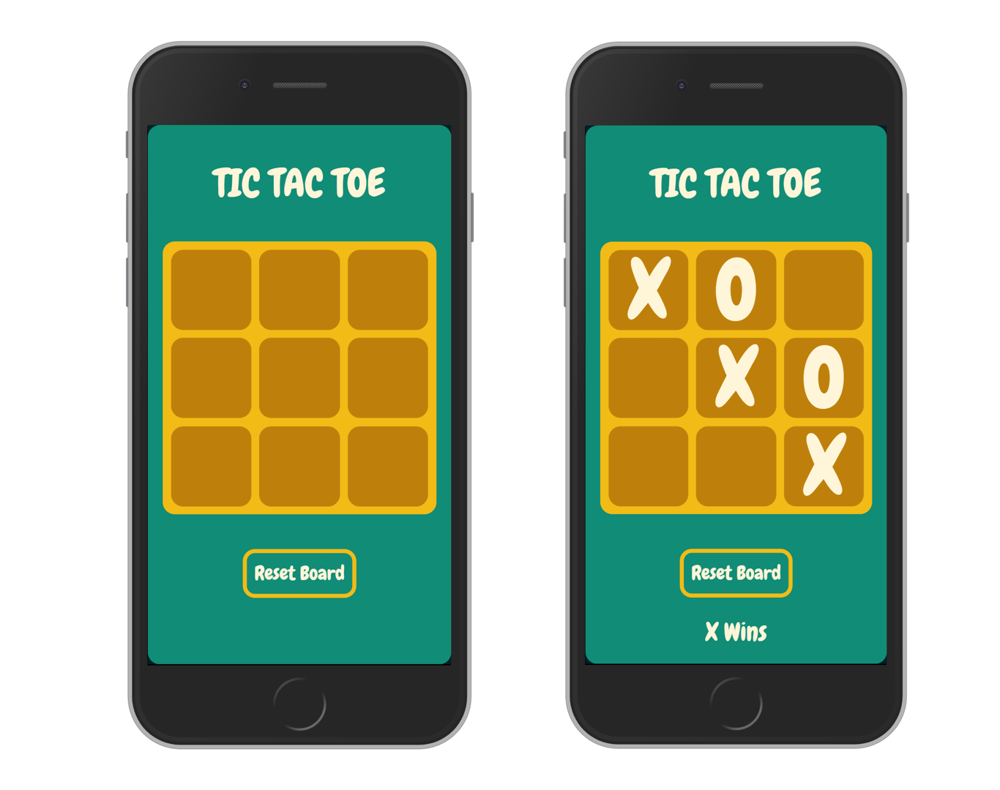

# Tic-tac-toe

> Tic-tac-toe game built using JavaScript.

This project emphasizes building projects using JavaScript's Factory Functions and The Module Pattern.

[//]: # (Screenshot, Application concept art etc)


[//]: # (Live Demo link)
<p align="center">
  <a href="https://raw.githack.com/juzQrios/tic-tac-toe/customize-style/index.html">Live Demo</a>
</p>

## Built With

* HTML
* CSS
* JavaScript

## Get Started

### Setup

1. Clone this repository.

```bash
git clone git@github.com:juzQrios/tic-tac-toe.git
cd tic-tac-toe
```

2. Install dependencies.

```bash
npm install
```

3. Open `index.html` using a browser.

### Tests

While it is a good practice to test code, this project doesn't have any tests right now but I might add them in future.

### Deployment

Deploy the repository's root directory.

## Contributing

Contributions, issues and feature requests are welcome!

Feel free to checkout this project's [Kanban board](https://github.com/juzQrios/readme-template/projects/1) or [issues page](https://github.com/juzQrios/readme-template/issues).

## Acknowledgments

* [Wikipedia](https://en.wikipedia.org/wiki/Tic-tac-toe) for Tic-tac-toe rules.

## License

This project is [MIT](./LICENSE) licensed.

## Authors

#### Darshan

* Github: [@juzQrios](https://github.com/juzQrios)
* Linkedin: [Darshan J](https://www.linkedin.com/in/jayadevdarshan/)
* Email: <jayadev.darshan@gmail.com>

#### Muhammad

* GitHub: [mosaaleb](https://github.com/mosaaleb)
* Linkedin: [Muhammed Ebeid](https://www.linkedin.com/in/muhammadebeid/)
